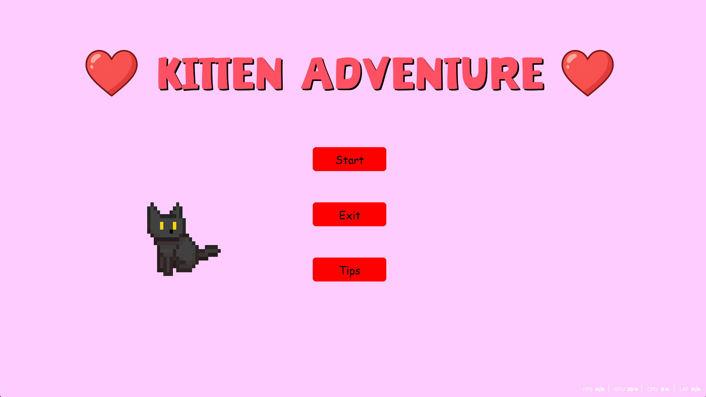

# 🐾 Kitten Adventure

A **2D adventure game** built in **Python (Pygame)** — a passion project I’m making for my girlfriend 💖  
You play as a **curious kitten** exploring the world, collecting fish, upgrading your abilities, and fighting off jellyfish enemies.  
Still a **work in progress**, but it’s shaping up into a cozy little game with smooth controls and a bit of challenge!

---

## 🎮 Features

- 🐱 **Smooth movement & animations** — responsive kitten controls with idle, run frames 
- 🎵 **Sound & Music** — background tracks, sound effects, and ambient loops  
- 🌅 **Dynamic world** — day/night cycle and environmental lighting  
- 🛠️ **Upgrade System** — improve speed or other upgrades using collected score
- 💾 **Save System** — keeps your progress between sessions   
- 🧠 **Expandable design** — easily add new enemies, areas, and upgrades  

---

## 🚀 How to Run

### 1️⃣ Prerequisites
Make sure you have **Python 3.10+** installed.

You can check with:
```bash
python --version
````

If not installed, grab it from [python.org](https://www.python.org/downloads/)

---

### 2️⃣ Install Dependencies

Install Pygame (and any other libraries if added later):

```bash
pip install pygame
```

---

### 3️⃣ Run the Game

Open your terminal or command prompt in the game folder:

```bash
python "Kitten Adventure.py"
```

---

## 🗺️ Planned Additions

* 🐟 **New areas**: forest, beach, and cave biomes
* 💎 **Collectibles** and secret treasures
* 👾 **Boss battles** (giant jellyfish and crabs)
---


## 📸 Screenshots





---

## 🧰 Tech Stack

* **Python 3.10+**
* **Pygame**
* **PyCharm** for development

---

## ⚖️ License

Released under the [MIT License](LICENSE)
Feel free to use or modify it — just credit **Adda**.

---

## ✨ Author

ItsAdda — Student & aspiring Python developer.
Learning by building real, useful tools.


